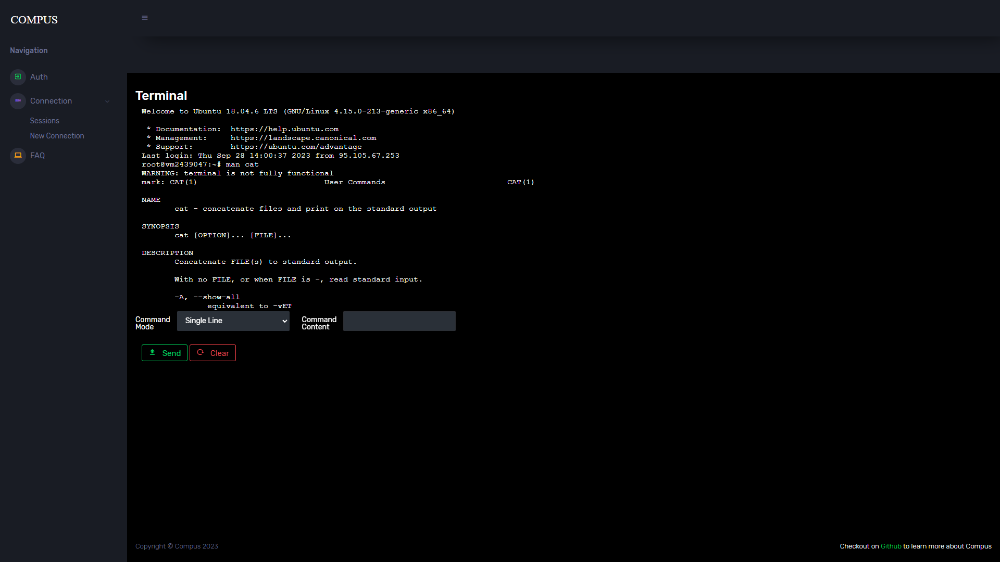
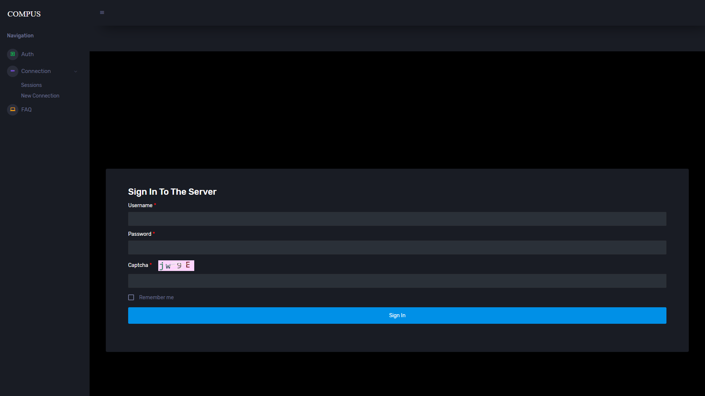
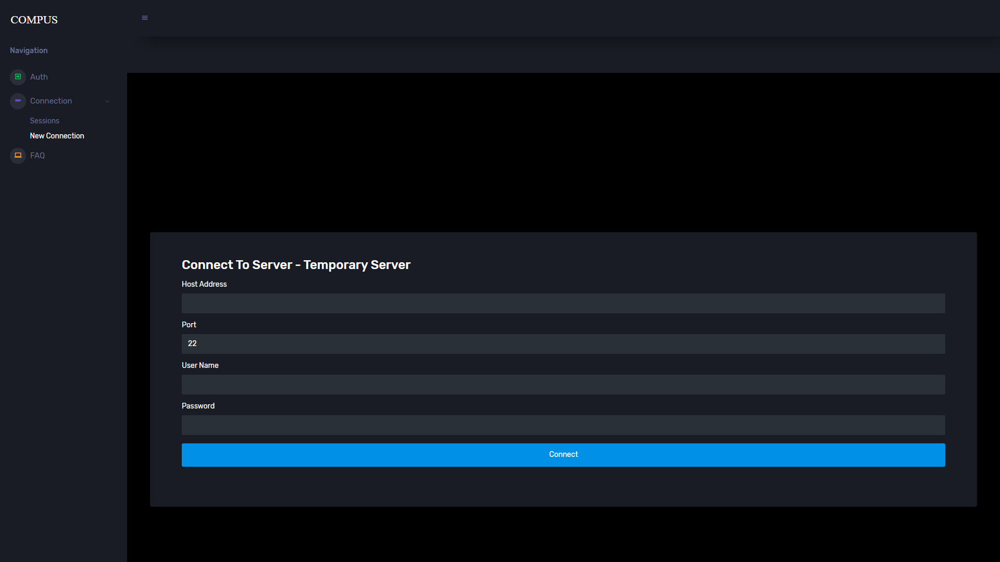
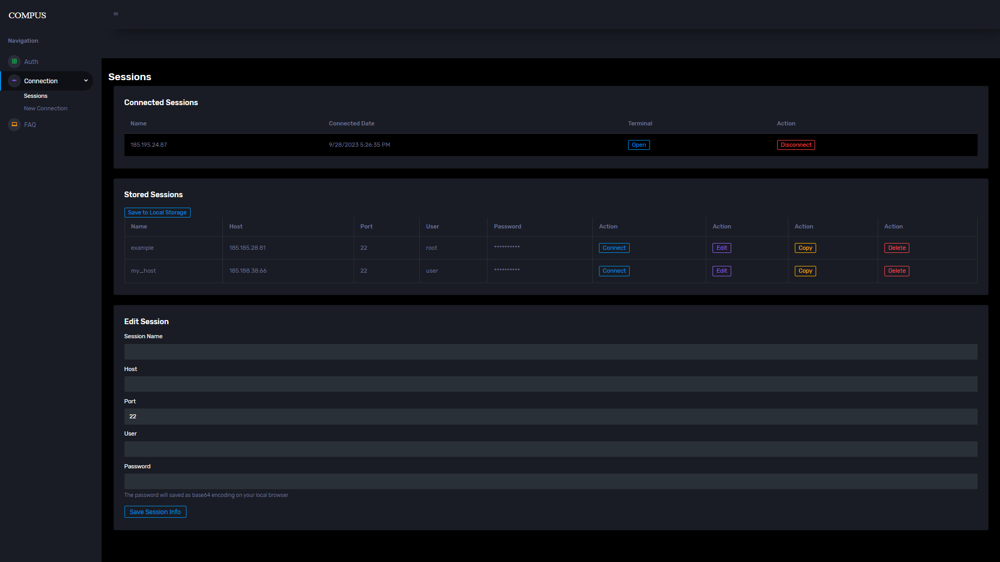
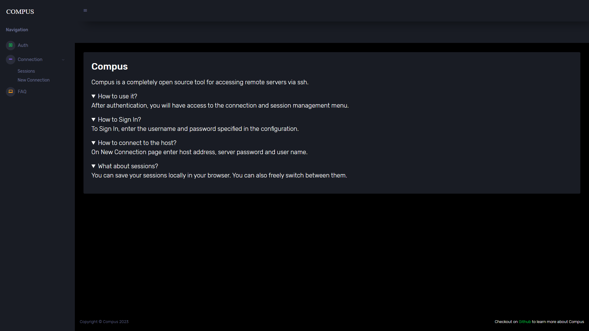

  
  

[**Compus**](https://github.com/sh1ngekyo/Compus) is a cross-platform SSH web client built using WebAssembly.

* Authentication.
* Remote connection and session management.
* Based on xterm.js, SSH.NET and Blazor WebAssembly.
* Two command mode.
* Supports keyboard.

---

# Auth

---
* Cookie-based auth.
* Currently, information about available users is stored in the configuration file.
* Authentication is not required in debug mode.
* Default UserName: **user**.
* Default Password: **password**.

# Connection

---
1. You must enter the host address, connection port, connection username and password for the remote server.
2. After that, click on the Connect button.

# Sessions

---
* **Compus** allows you to save information about connected hosts directly in your browser.
* You can connect, edit and delete sessions on the Sessions page.

  
# Faq

